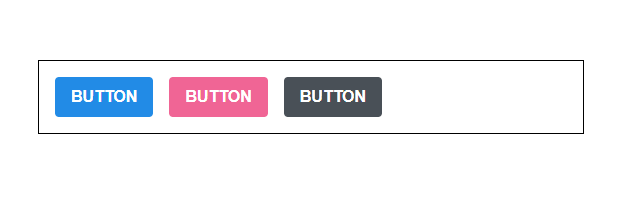
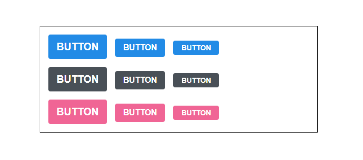
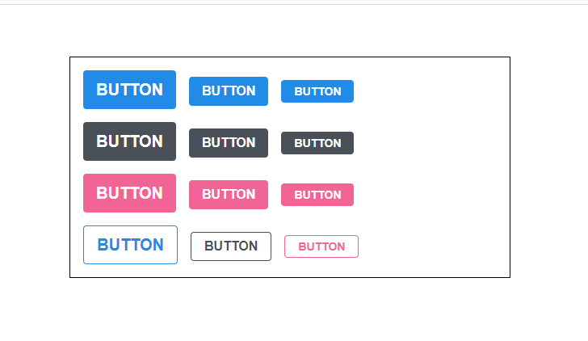
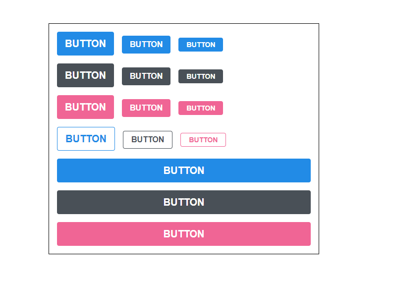
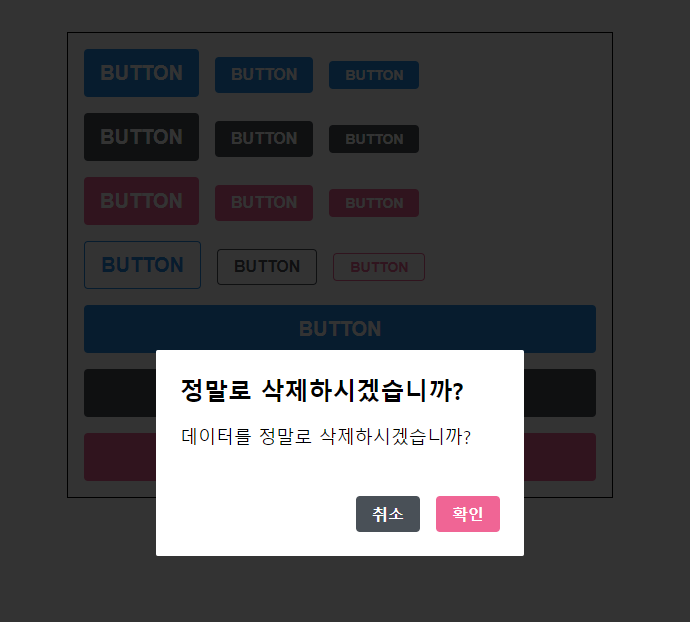
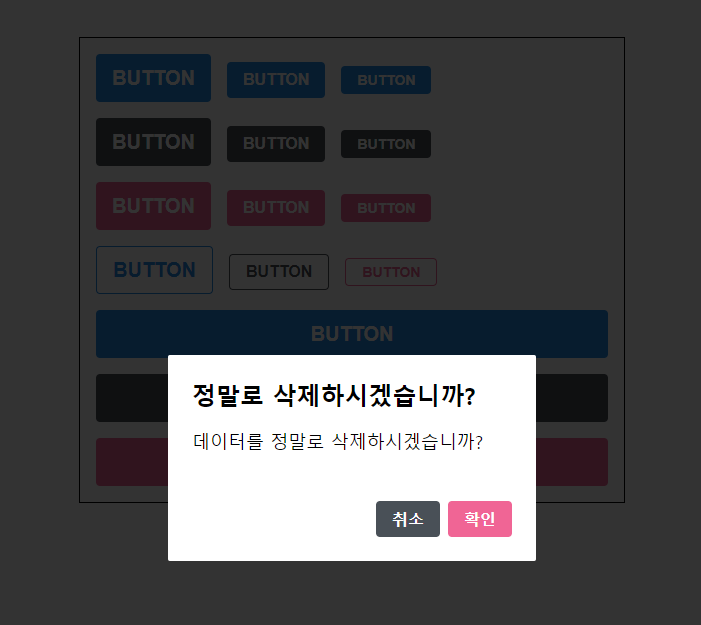
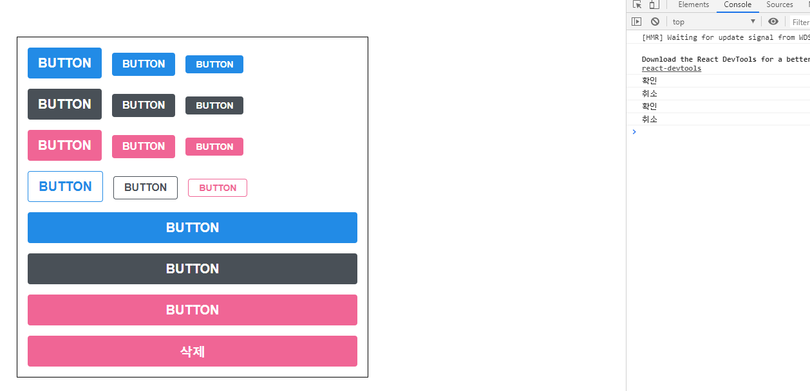

# styled-components

CSS in JS를 쉽게 할 수 있게 해주는 라이브러리이다.

### Tagged Template Literal

style-components는 Tagged Template Literal 이라는 문법을 활용하여 구현되어 있다.
그렇기 때문에 Tagged Template Literal을 이해하면 내부적으로 어떻게 작동하는 지 이해할 수 있다.
Template Literal은 문자열 조합을 쉽게 해주는 ES6 문법이다.

```javascript
const name = 'react';
const message = `hello ${name}`;

console.log(message);
// "hello react"
```

`${}`에 문자열이 들어가는 것을 확인할 수 있다. 

```javascript
const object = { a : 1};
const text = `${object}`
console.log(text);
// "[object Object]"

const fn = () => true
const msg = `${fn}`
console.log(msg);
// "() => true"
```

객체나 함수를 넣으면 그 자체가 문자화 되어 저장됨을 알 수 있다.

이런 Template Literal을 사용하면서 그 내부에 넣은 자바스크립트의 값을 조회하고 싶다면, 

Tagged Template Literal 문법을 사용해야 한다.

```javascript
const red = "빨간색"
const blue = "파란색"
function favoriteColors(texts, ...values) {
    console.log(texts);
    console.log(values);
}
favoriteColors`제가 좋아하는 색은 ${red}과 ${blue}입니다.`
// (3) ["제가 좋아하는  색은 ", "과 ", "입니다.", raw: Array(3)]
// (2) ["빨간색", "파란색"]
```

`rest` 문법을 사용하여 `${}`로 넣어준 값과 텍스트를 따로 확인할 수 있다.

이러한 문법을 이용하여 props로 전달받아 조건에 맞는 style-components를 구현할 수 있다.

```javascript
const StyledDiv = styled`
  background: ${props => props.color};
`;
```

`${}`에 함수를 넣어줬다면, Tagged Template Literal을 사용하여 해당 함수를 활용할 수 있다.

```javascript
function sample(texts, ...fns) {
  const mockProps = {
    title: '안녕하세요',
    body: '내용은 내용내용 입니다.'
  };
  console.log("texts: ", texts)
  console.log("fns: ", fns)
  return texts.reduce((result, text, i) => `${result}${text}${fns[i] ? fns[i](mockProps) : ''}`, '');
}
sample`
  제목: ${props => props.title}
  내용: ${props => props.body}
`
/*
texts: [ '\n  제목: ', '\n  내용: ', '\n' ] 
fns: [ [Function], [Function] ]
"
  제목: 안녕하세요
  내용: 내용은 내용내용 입니다.
"
*/
```

`sample` 함수는 입력값을 `exts`와 `fns`으로 나누게 된다.  그다음 `reduce` 함수에 의해 결과 값을 나타내고 있다.


### styled-components 사용하기

개발환경 구성, styled-components 설치

```bash
$ create-react-app styling-with-styled-components
$ cd styling-with-styled-components
$ npm i styled-components
```


- **App.js**

  ```javascript
  import React from "react";
  import styled from "styled-components";
  
  const Circle = styled.div`
    width: 5rem;
    height: 5rem;
    background: black;
    border-radius: 50%;
  `;
  
  function App() {
    return <Circle />;
  }
  
  export default App;
  ```

  

  

  styled-components 를 통해 스타일을 입력하면서 해당 스타일을 가진 컴포넌트를 만들 수 있다.

  props에 `color`조건을 넣어 색을 바꿀 수 있다.

  

- **App.js**

  ```javascript
  import React from "react";
  import styled from "styled-components";
  
  const Circle = styled.div`
    width: 5rem;
    height: 5rem;
    background: ${(props) => props.color || "black"};
    border-radius: 50%;
  `;
  
  function App() {
    return <Circle color="blue" />;
  }
  
  export default App;
  ```
  
  
  
  
  
  
  
  `color`에 `blue` 값을 주어 색을 바꿀 수 있게 되었다. 다음은 `huge` props를 설정하여 크기를 키우는 작업을 할 것이다.
  
- **App.js**
  
  ```javascript
  import React from "react";
  import styled, { css } from "styled-components";
  
  const Circle = styled.div`
    width: 5rem;
    height: 5rem;
    background: ${(props) => props.color || "black"};
    border-radius: 50%;
    ${(props) =>
      props.huge &&
      css`
        width: 10rem;
        height: 10rem;
      `}
  `;
  
  const App = () => (
    <>
      <Circle color="blue" huge />
      <Circle color="blue" />
    </>
  );
  
  export default App;
  ```
  
  

	

	props에 `huge`를 주고 `huge`가 있다면 css를 적용하도록 하였다.

	이런식으로 여러 줄의 CSS 코드를 조건부로 보여주고 싶다면 `css` 를 사용해야 한다.  `css` 를 불러와서 사용을 해야 그 스타일 내부에서도 다른 `props` 를 조회 할 수 있다.


### Button 만들기


- **components/Button.js**

  ```javascript
  import React from "react";
  import styled from "styled-components";
  
  const StyledButton = styled.button`
    /* 공통 스타일 */
    display: inline-flex;
    outline: none;
    border: none;
    border-radius: 4px;
    color: white;
    font-weight: bold;
    cursor: pointer;
    align-items: center;
    padding-left: 1rem;
    padding-right: 1rem;
    /* 크기 */
    font-size: 1rem;
    height: 2.5rem;
    /* 색상 */
    background: #228be6;
    &:hover {
      background: #339af0;
    }
    &:active {
      background: #1c7ed6;
    }
  
    /* 기타 */
    & + & {
      margin-left: 1rem;
    }
  `;
  
  function Button({ children, ...rest }) {
    return <StyledButton {...rest}>{children}</StyledButton>;
  }
  
  export default Button;
  ```

  

  

  

### polished의 스타일 관련 유틸 함수 사용하기

CSS in JS에서 색상의 변화를 주는 유틸 함수를 사용하고 싶다면  `polished 라는 라이브러리를 사용하면 된다.


패키지  설치

```bash
$ npm i polished
```


기존 색상을 `polished`로 대체

- **Button.js**

  ```javascript
  import React from "react";
  import styled from "styled-components";
  import { darken, lighten } from "polished";
  const StyledButton = styled.button`
    /* 공통 스타일 */
    display: inline-flex;
    outline: none;
    border: none;
    border-radius: 4px;
    color: white;
    font-weight: bold;
    cursor: pointer;
    align-items: center;
    padding-left: 1rem;
    padding-right: 1rem;
    /* 크기 */
    font-size: 1rem;
    height: 2.5rem;
    /* 색상 */
    background: #228be6;
    &:hover {
      background: ${lighten(0.1, "#228be6")}; // 1에 가까울수록 밝다.
    }
    &:active {
      background: ${darken(0.1, "#228be6")}; // 1에 가까울수록 어둡다.
    }
  
    /* 기타 */
    & + & {
      margin-left: 1rem;
    }
  `;
  
  function Button({ children, ...rest }) {
    return <StyledButton {...rest}>{children}</StyledButton>;
  }
  
  export default Button;
  
  ```

  

  색상 코드를 지닌 변수를 `Button.js`에서 선언하는 대신 `ThemeProvider` 라는 기능을 사용하여 styled-components로 만드는 모든 컴포넌트에서 조회하여 사용 할 수 있는 전역적인 값을 설정한다.

- **App.js**

  ```javascript
  import React from 'react';
  import styled, { ThemeProvider } from 'styled-components';
  import Button from './components/Button';
  
  const AppBlock = styled.div`
    width: 512px;
    margin: 0 auto;
    margin-top: 4rem;
    border: 1px solid black;
    padding: 1rem;
  `;
  
  function App() {
    return (
      <ThemeProvider
        theme={{
          palette: {
            blue: '#228be6',
            gray: '#495057',
            pink: '#f06595'
          }
        }}
      >
        <AppBlock>
          <Button>BUTTON</Button>
        </AppBlock>
      </ThemeProvider>
    );
  }
  
  export default App;
  ```

  

  `theme`을 설정하면 `ThemeProvider` 내부에 렌더링된 styled-components로 만든 컴포넌트에서 `palette` 를 조회하여 사용할 수 있다. `Button` 컴포넌트에서 `palette.blue`를 조회해보자.

  

- **Button.js**

  ```javascript
  import React from 'react';
  import styled, { css } from 'styled-components';
  import { darken, lighten } from 'polished';
  
  const StyledButton = styled.button`
    /* 공통 스타일 */
    display: inline-flex;
    outline: none;
    border: none;
    border-radius: 4px;
    color: white;
    font-weight: bold;
    cursor: pointer;
    padding-left: 1rem;
    padding-right: 1rem;
  
    /* 크기 */
    height: 2.25rem;
    font-size: 1rem;
  
    /* 색상 */
    ${props => {
      const selected = props.theme.palette.blue;
      return css`
        background: ${selected};
        &:hover {
          background: ${lighten(0.1, selected)};
        }
        &:active {
          background: ${darken(0.1, selected)};
        }
      `;
    }}
  
    /* 기타 */
    & + & {
      margin-left: 1rem;
    }
  `;
  
  function Button({ children, ...rest }) {
    return <StyledButton {...rest}>{children}</StyledButton>;
  }
  
  export default Button;
  ```

  `ThemeProvider`로 설정한 값은 styled-components에서 `props.theme`로 조회할 수 있다. 지금은 `selected` 값을 무조건 `blue` 값으로 가리키게 했지만, `Button` 컴포넌트의 props를 통해 `color`를 받아오도록 수정한다.

  

- **Button.js**

  ```javascript
  import React from 'react';
  import styled, { css } from 'styled-components';
  import { darken, lighten } from 'polished';
  
  const StyledButton = styled.button`
    /* 공통 스타일 */
    display: inline-flex;
    outline: none;
    border: none;
    border-radius: 4px;
    color: white;
    font-weight: bold;
    cursor: pointer;
    padding-left: 1rem;
    padding-right: 1rem;
  
    /* 크기 */
    height: 2.25rem;
    font-size: 1rem;
  
    /* 색상 */
    ${props => {
      const selected = props.theme.palette[props.color];
      return css`
        background: ${selected};
        &:hover {
          background: ${lighten(0.1, selected)};
        }
        &:active {
          background: ${darken(0.1, selected)};
        }
      `;
    }}
  
    /* 기타 */
    & + & {
      margin-left: 1rem;
    }
  `;
  
  function Button({ children, ...rest }) {
    return <StyledButton {...rest}>{children}</StyledButton>;
  }
  
  // props가 주어지지 않았을 때, 기본 props로 설정할 수 있다. 
  Button.defaultProps = {
    color: 'blue'
  };
  
  export default Button;
  ```

  기본 값을 blue로 주었고 회색, 핑크색 버튼을 만들어 렌더링해보자.

  

- **App.js**

  ```javascript
  import React from 'react';
  import styled, { ThemeProvider } from 'styled-components';
  import Button from './components/Button';
  
  const AppBlock = styled.div`
    width: 512px;
    margin: 0 auto;
    margin-top: 4rem;
    border: 1px solid black;
    padding: 1rem;
  `;
  
  function App() {
    return (
      <ThemeProvider
        theme={{
          palette: {
            blue: '#228be6',
            gray: '#495057',
            pink: '#f06595'
          }
        }}
      >
        <AppBlock>
          <Button>BUTTON</Button>
          <Button color="pink">BUTTON</Button>
          <Button color="gray">BUTTON</Button>
        </AppBlock>
      </ThemeProvider>
    );
  }
  
  export default App;
  ```

  

  

  

  

  Button 컴포넌트를 다음과 같이 리팩토링 할 수 있다.

  

- **components/Button.js**

  ```javascript
  import React from 'react';
  import styled, { css } from 'styled-components';
  import { darken, lighten } from 'polished';
  
  const StyledButton = styled.button`
    /* 공통 스타일 */
    display: inline-flex;
    outline: none;
    border: none;
    border-radius: 4px;
    color: white;
    font-weight: bold;
    cursor: pointer;
    padding-left: 1rem;
    padding-right: 1rem;
  
    /* 크기 */
    height: 2.25rem;
    font-size: 1rem;
  
    /* 색상 */
    // 비구조화 할당 문법을 사용하여 props에서 theme와 color를 빼내어 가독성을 높일 수 있다.
    ${({ theme, color }) => {
      const selected = theme.palette[color];
      return css`
        background: ${selected};
        &:hover {
          background: ${lighten(0.1, selected)};
        }
        &:active {
          background: ${darken(0.1, selected)};
        }
      `;
    }}
  
    /* 기타 */
    & + & {
      margin-left: 1rem;
    }
  `;
  
  function Button({ children, color, ...rest }) {
    return <StyledButton color={color} {...rest}>{children}</StyledButton>;
  }
  
  Button.defaultProps = {
    color: 'blue'
  };
  
  export default Button;
  ```

  

  또 다음처럼 색상 관련 코드를 따로 분리하여 사용 할  수 있다.

  

- **Button.js**

  ```javascript
  import React from "react";
  import styled, { css } from "styled-components";
  import { darken, lighten } from "polished";
  
  const colorStyles = css`
    ${({ theme, color }) => {
      const selected = theme.palette[color];
      return css`
        background: ${selected};
  
        &:hover {
          background: ${lighten(0.1, selected)};
        }
        &:active {
          background: ${darken(0.1, selected)};
        }
      `;
    }}
  `;
  
  const StyledButton = styled.button`
    /* 공통 스타일 */
    display: inline-flex;
    outline: none;
    border: none;
    border-radius: 4px;
    color: white;
    font-weight: bold;
    cursor: pointer;
    align-items: center;
    padding-left: 1rem;
    padding-right: 1rem;
    /* 크기 */
    font-size: 1rem;
    height: 2.25rem;
  
    /* 색상 */
    // 색상관련 코드가 길어 따로 변수로 빼내어 관리한다.
    ${colorStyles} 
    /* 기타 */
    & + & {
      margin-left: 1rem;
    }
  `;
  
  function Button({ children, color, ...rest }) {
    return (
      <StyledButton color={color} {...rest}>
        {children}
      </StyledButton>
    );
  }
  
  // 기본 Props 설정
  Button.defaultProps = {
    color: "blue",
  };
  
  export default Button;
  
  ```

  

  그 다음에는, `size` props를 설정하여 버튼의 크기를 다양하게 만든다.

  

- **components/Button.js**

  ```javascript
  import React from "react";
  import styled, { css } from "styled-components";
  import { darken, lighten } from "polished";
  
  const colorStyles = css`
    ${({ theme, color }) => {
      const selected = theme.palette[color];
      return css`
        background: ${selected};
  
        &:hover {
          background: ${lighten(0.1, selected)};
        }
        &:active {
          background: ${darken(0.1, selected)};
        }
      `;
    }}
  `;
  
  const sizeStyles = css`
    ${(props) =>
      props.size === "large" &&
      css`
        height: 3rem;
        font-size: 1.25rem;
      `}
    ${(props) =>
      props.size === "medium" &&
      css`
        height: 2.25rem;
        font-size: 1rem;
      `}
    ${(props) =>
      props.size === "small" &&
      css`
        height: 1.75rem;
        font-size: 0.875rem;
      `}
  `;
  
  const StyledButton = styled.button`
    /* 공통 스타일 */
    display: inline-flex;
    outline: none;
    border: none;
    border-radius: 4px;
    color: white;
    font-weight: bold;
    cursor: pointer;
    align-items: center;
    padding-left: 1rem;
    padding-right: 1rem;
    /* 크기 */
    ${sizeStyles}
  
    /* 색상 */
    ${colorStyles}
    /* 기타 */
    & + & {
      margin-left: 1rem;
    }
  `;
  
  function Button({ children, color, size, ...rest }) {
    return (
      <StyledButton color={color} size={size} {...rest}>
        {children}
      </StyledButton>
    );
  }
  
  // 기본 Props 설정
  Button.defaultProps = {
    color: "blue",
    size: "medium",
  };
  
  export default Button;
  ```

  `sizeStyles` 에 해당하는 코드를 따로 분리하지 않고 StyledButton 의 스타일 내부에 바로 적어도 상관은 없다. 다만, 이렇게 분리해두면 나중에 유지보수를 할 때 더 편해질 수 있다.

  이제 커스터마이징된 버튼들을 렌더링하자.

  

- **App.js**

  ```javascript
  import React from "react";
  import styled, { ThemeProvider } from "styled-components";
  import Button from "./components/Button.js";
  import theme from "./theme";
  
  const AppBlock = styled.div`
    width: 512px;
    margin: 0 auto;
    margin-top: 4rem;
    border: 1px solid black;
    padding: 1rem;
  `;
  const ButtonGroup = styled.div`
    & + & {
      margin-top: 1rem;
    }
  `;
  
  function App() {
    return (
      <ThemeProvider theme={theme}>
        <AppBlock>
          <ButtonGroup>
            <Button size="large">BUTTON</Button>
            <Button>BUTTON</Button>
            <Button size="small">BUTTON</Button>
          </ButtonGroup>
          <ButtonGroup>
            <Button color="gray" size="large">
              BUTTON
            </Button>
            <Button color="gray">BUTTON</Button>
            <Button color="gray" size="small">
              BUTTON
            </Button>
          </ButtonGroup>
          <ButtonGroup>
            <Button color="pink" size="large">
              BUTTON
            </Button>
            <Button color="pink">BUTTON</Button>
            <Button color="pink" size="small">
              BUTTON
            </Button>
          </ButtonGroup>
        </AppBlock>
      </ThemeProvider>
    );
  }
  
  export default App;
  ```

  `ButtonGroup` 컴포넌트를 통해 그룹간 여백을 `1rem`으로 설정.

  

  `SizeStyles` 의 중복되는 코드들을 리팩토링 할 수 있다.

- **components/Button.js**

  ```javascript
  import React from "react";
  import styled, { css } from "styled-components";
  import { darken, lighten } from "polished";
  
  const colorStyles = css`
    ${({ theme, color }) => {
      const selected = theme.palette[color];
      return css`
        background: ${selected};
  
        &:hover {
          background: ${lighten(0.1, selected)};
        }
        &:active {
          background: ${darken(0.1, selected)};
        }
      `;
    }}
  `;
  
  const sizes = {
    large: {
      height: "3rem",
      fontSize: "1.25rem",
    },
    medium: {
      height: "2.25rem",
      fontSize: "1rem",
    },
    small: {
      height: "1.75rem",
      fontSize: "0.875rem",
    },
  };
  
  const sizeStyles = css`
    ${({ size }) => css`
      height: ${sizes[size].height};
      font-size: ${sizes[size].fontSize};
    `}
  `;
  
  const StyledButton = styled.button`
    /* 공통 스타일 */
    display: inline-flex;
    outline: none;
    border: none;
    border-radius: 4px;
    color: white;
    font-weight: bold;
    cursor: pointer;
    align-items: center;
    padding-left: 1rem;
    padding-right: 1rem;
    /* 크기 */
    ${sizeStyles}
  
    /* 색상 */
    ${colorStyles}
    /* 기타 */
    & + & {
      margin-left: 1rem;
    }
  `;
  
  function Button({ children, color, size, ...rest }) {
    return (
      <StyledButton color={color} size={size} {...rest}>
        {children}
      </StyledButton>
    );
  }
  
  // 기본 Props 설정
  Button.defaultProps = {
    color: "blue",
    size: "medium",
  };
  
  export default Button;
  ```

  

  이 다음에는 Button 컴포넌트에 `outline` 이라는 props를 설정하여 이 값이 `true`일 때 테두리만 지닌 버튼을 보여주도록 설정한다. 이 작업을 할 때는 `colorStyles`만 수정하면 된다.
  
  
  
- **components/Button.js**
  
  ```javascript
  import React from "react";
  import styled, { css } from "styled-components";
  import { darken, lighten } from "polished";
  
  const colorStyles = css`
    ${({ theme, color }) => {
      const selected = theme.palette[color];
      return css`
        background: ${selected};
  
        &:hover {
          background: ${lighten(0.1, selected)};
        }
        &:active {
          background: ${darken(0.1, selected)};
        }
        ${(props) =>
          props.outline &&
          css`
            color: ${selected};
            background: none;
            border: 1px solid ${selected};
            &:hover {
              background: ${selected};
              color: white;
            }
          `}
      `;
    }}
  `;
  
  const sizes = {
    large: {
      height: "3rem",
      fontSize: "1.25rem",
    },
    medium: {
      height: "2.25rem",
      fontSize: "1rem",
    },
    small: {
      height: "1.75rem",
      fontSize: "0.875rem",
    },
  };
  
  const sizeStyles = css`
    ${({ size }) => css`
      height: ${sizes[size].height};
      font-size: ${sizes[size].fontSize};
    `}
  `;
  
  const StyledButton = styled.button`
    /* 공통 스타일 */
    display: inline-flex;
    outline: none;
    border: none;
    border-radius: 4px;
    color: white;
    font-weight: bold;
    cursor: pointer;
    align-items: center;
    padding-left: 1rem;
    padding-right: 1rem;
    /* 크기 */
    ${sizeStyles}
  
    /* 색상 */
    ${colorStyles}
    /* 기타 */
    & + & {
      margin-left: 1rem;
    }
  `;
  
  function Button({ children, color, size, ...rest }) {
    return (
      <StyledButton color={color} size={size} {...rest}>
        {children}
      </StyledButton>
    );
  }
  
  // 기본 Props 설정
  Button.defaultProps = {
    color: "blue",
    size: "medium",
  };
  
  export default Button;
  ```
  
  `colorStyles`에서 outline의 여부에 따라 색을 바꾸는 작업을 하였다.
  
  App에서 outline 버튼을 렌더링하자.
  
  
  
  
  
- **App.js**

  ```javascript
  import React from "react";
  import styled, { ThemeProvider } from "styled-components";
  import Button from "./components/Button.js";
  import theme from "./theme";
  
  const AppBlock = styled.div`
    width: 512px;
    margin: 0 auto;
    margin-top: 4rem;
    border: 1px solid black;
    padding: 1rem;
  `;
  const ButtonGroup = styled.div`
    & + & {
      margin-top: 1rem;
    }
  `;
  
  function App() {
    return (
      <ThemeProvider theme={theme}>
        <AppBlock>
          <ButtonGroup>
            <Button size="large">BUTTON</Button>
            <Button>BUTTON</Button>
            <Button size="small">BUTTON</Button>
          </ButtonGroup>
          <ButtonGroup>
            <Button color="gray" size="large">
              BUTTON
            </Button>
            <Button color="gray">BUTTON</Button>
            <Button color="gray" size="small">
              BUTTON
            </Button>
          </ButtonGroup>
          <ButtonGroup>
            <Button color="pink" size="large">
              BUTTON
            </Button>
            <Button color="pink">BUTTON</Button>
            <Button color="pink" size="small">
              BUTTON
            </Button>
          </ButtonGroup>
          <ButtonGroup>
          <Button size="large" outline>
            BUTTON
          </Button>
          <Button color="gray" outline>BUTTON</Button>
          <Button color="pink" size="small" outline>
            BUTTON
          </Button>
        </ButtonGroup>
        </AppBlock>
      </ThemeProvider>
    );
  }
  
  export default App;
  ```

  

  

  이제 Button 컴포넌트에서 해야 할 마지막 작업이 한가지 더 남았다. `fullWidth` 라는 props 가 주어졌다면 버튼의 크기가 100% 를 차지하도록 만들어보자.

  

- **components/Button.js**

  ```javascript
  import React from "react";
  import styled, { css } from "styled-components";
  import { darken, lighten } from "polished";
  
  const colorStyles = css`
    ${({ theme, color }) => {
      const selected = theme.palette[color];
      return css`
        background: ${selected};
  
        &:hover {
          background: ${lighten(0.1, selected)};
        }
        &:active {
          background: ${darken(0.1, selected)};
        }
        ${(props) =>
          props.outline &&
          css`
            color: ${selected};
            background: none;
            border: 1px solid ${selected};
            &:hover {
              background: ${selected};
              color: white;
            }
          `}
      `;
    }}
  `;
  
  const sizes = {
    large: {
      height: "3rem",
      fontSize: "1.25rem",
    },
    medium: {
      height: "2.25rem",
      fontSize: "1rem",
    },
    small: {
      height: "1.75rem",
      fontSize: "0.875rem",
    },
  };
  
  const sizeStyles = css`
    ${({ size }) => css`
      height: ${sizes[size].height};
      font-size: ${sizes[size].fontSize};
    `}
  `;
  
  const fullWidthStyle = css`
    ${(props) =>
      props.fullWidth &&
      css`
        width: 100%;
        justify-content: center;
        & + & {
          margin-left: 0;
          margin-top: 1rem;
        }
      `}
  `;
  
  const StyledButton = styled.button`
    /* 공통 스타일 */
    display: inline-flex;
    outline: none;
    border: none;
    border-radius: 4px;
    color: white;
    font-weight: bold;
    cursor: pointer;
    align-items: center;
    padding-left: 1rem;
    padding-right: 1rem;
    /* 크기 */
    ${sizeStyles}
  
    /* 색상 */
    ${colorStyles}
    /* 기타 */
    & + & {
      margin-left: 1rem;
    }
  
    ${fullWidthStyle}
  `;
  
  function Button({ children, color, size, outline, fullWidth, ...rest }) {
    return (
      <StyledButton
        color={color}
        size={size}
        outline={outline}
        fullWidth={fullWidth}
        {...rest}
      >
        {children}
      </StyledButton>
    );
  }
  
  // 기본 Props 설정
  Button.defaultProps = {
    color: "blue",
    size: "medium",
  };
  
  export default Button;
  ```
  
  
  
  
  `fullWidth` 스타일을 가진 컴포넌트를 렌더링하자.
  
- **App.js**

  ```javascript
  import React from "react";
  import styled, { ThemeProvider } from "styled-components";
  import Button from "./components/Button.js";
  import theme from "./theme";
  
  const AppBlock = styled.div`
    width: 512px;
    margin: 0 auto;
    margin-top: 4rem;
    border: 1px solid black;
    padding: 1rem;
  `;
  const ButtonGroup = styled.div`
    & + & {
      margin-top: 1rem;
    }
  `;
  
  function App() {
    return (
      <ThemeProvider theme={theme}>
        <AppBlock>
          <ButtonGroup>
            <Button size="large">BUTTON</Button>
            <Button>BUTTON</Button>
            <Button size="small">BUTTON</Button>
          </ButtonGroup>
          <ButtonGroup>
            <Button color="gray" size="large">
              BUTTON
            </Button>
            <Button color="gray">BUTTON</Button>
            <Button color="gray" size="small">
              BUTTON
            </Button>
          </ButtonGroup>
          <ButtonGroup>
            <Button color="pink" size="large">
              BUTTON
            </Button>
            <Button color="pink">BUTTON</Button>
            <Button color="pink" size="small">
              BUTTON
            </Button>
          </ButtonGroup>
          <ButtonGroup>
            <Button size="large" outline>
              BUTTON
            </Button>
            <Button color="gray" outline>
              BUTTON
            </Button>
            <Button color="pink" size="small" outline>
              BUTTON
            </Button>
          </ButtonGroup>
          <ButtonGroup>
            <Button size="large" fullWidth>
              BUTTON
            </Button>
            <Button size="large" color="gray" fullWidth>
              BUTTON
            </Button>
            <Button size="large" color="pink" fullWidth>
              BUTTON
            </Button>
          </ButtonGroup>
        </AppBlock>
      </ThemeProvider>
    );
  }
  
  export default App;
  ```

  

  

### Dialog 만들기

Dialog 컴포넌트를 만들자.

이 컴포넌트를 만드는 과정에서 앞서 만든 Button 컴포넌트를 재사용하게 된다.

- **components/Dialog.js**

  ```javascript
import React from 'react';
  import styled from 'styled-components';
import Button from './Button';
  
  const DarkBackground = styled.div`
    position: fixed;
    left: 0;
    top: 0;
    width: 100%;
    height: 100%;
    display: flex;
    align-items: center;
    justify-content: center;
    background: rgba(0, 0, 0, 0.8);
  `;
  
  const DialogBlock = styled.div`
    width: 320px;
    padding: 1.5rem;
    background: white;
    border-radius: 2px;
    h3 {
      margin: 0;
      font-size: 1.5rem;
    }
    p {
      font-size: 1.125rem;
    }
  `;
  
  const ButtonGroup = styled.div`
    margin-top: 3rem;
    display: flex;
    justify-content: flex-end;
  `;
  
  function Dialog({ title, children, confirmText, cancelText }) {
    return (
      <DarkBackground>
        <DialogBlock>
          <h3>{title}</h3>
          <p>{children}</p>
          <ButtonGroup>
            <Button color="gray">{cancelText}</Button>
            <Button color="pink">{confirmText}</Button>
          </ButtonGroup>
        </DialogBlock>
      </DarkBackground>
    );
  }
  
  Dialog.defaultProps = {
    confirmText: '확인',
    cancelText: '취소'
  };
  
  export default Dialog;
  ```
  
  
  
  h3 와 p를 스타일링 때  
  
  ```javascript
  const Title = styled.h3``;
  const Description = styled.p``;
  ```
  
  위처럼 따로 컴포넌트를 만들지 않아도 styled-components에서 Nested CSS 문법을 사용할 수 있기 때문에, DialogBlock 안에 있는 h3와 p에게 특정  스타일을 주고 싶다면 다음과 같이 작성하면 된다.
  
  ```javascript
  const DialogBlock = styled.div`
  h3 {}
  p {}
  `
  ```
  
  
  
  이제 App에 렌더링을 해보자.
  
  
  
- **App.js**
  
  ```javascript
  import React from 'react';
  import styled, { ThemeProvider } from 'styled-components';
  import Button from './components/Button';
  import Dialog from './components/Dialog';
  
  const AppBlock = styled.div`
    width: 512px;
    margin: 0 auto;
    margin-top: 4rem;
    border: 1px solid black;
    padding: 1rem;
  `;
  
  const ButtonGroup = styled.div`
    & + & {
      margin-top: 1rem;
    }
  `;
  
  function App() {
    return (
      <ThemeProvider
        theme={{
          palette: {
            blue: '#228be6',
            gray: '#495057',
            pink: '#f06595'
          }
        }}
      >
        <>
          <AppBlock>
            <ButtonGroup>
              <Button size="large">BUTTON</Button>
              <Button>BUTTON</Button>
              <Button size="small">BUTTON</Button>
            </ButtonGroup>
            <ButtonGroup>
              <Button color="gray" size="large">
                BUTTON
              </Button>
              <Button color="gray">BUTTON</Button>
              <Button color="gray" size="small">
                BUTTON
              </Button>
            </ButtonGroup>
            <ButtonGroup>
              <Button color="pink" size="large">
                BUTTON
              </Button>
              <Button color="pink">BUTTON</Button>
              <Button color="pink" size="small">
                BUTTON
              </Button>
            </ButtonGroup>
            <ButtonGroup>
              <Button size="large" outline>
                BUTTON
              </Button>
              <Button color="gray" outline>
                BUTTON
              </Button>
              <Button color="pink" size="small" outline>
                BUTTON
              </Button>
            </ButtonGroup>
            <ButtonGroup>
              <Button size="large" fullWidth>
                BUTTON
              </Button>
              <Button size="large" color="gray" fullWidth>
                BUTTON
              </Button>
              <Button size="large" color="pink" fullWidth>
                BUTTON
              </Button>
            </ButtonGroup>
          </AppBlock>
          <Dialog
            title="정말로 삭제하시겠습니까?"
            confirmText="삭제"
            cancelText="취소"
          >
            데이터를 정말로 삭제하시겠습니까?
          </Dialog>
        </>
      </ThemeProvider>
    );
  }
  
  export default App;
  ```
  
  
  
  
  
  이 Dialog 에서는 취소 버튼과 삭제 버튼의 간격이 조금 넓어보이는 느낌이 있는데, 만약에 styled-components로 컴포넌트의 스타일을 특정 상황에서 덮어쓰는 방법에 대해서 알아보자.
  
  Dialog.js 에서 다음과 같이 ShortMarginButton 을 만들고 기존 Button 을 대체시켜 보자.
  
- **components/Dialog.js**

  ```javascript
  import React from 'react';
  import styled from 'styled-components';
  import Button from './Button';
  
  const DarkBackground = styled.div`
    position: fixed;
    left: 0;
    top: 0;
    width: 100%;
    height: 100%;
    display: flex;
    align-items: center;
    justify-content: center;
    background: rgba(0, 0, 0, 0.8);
  `;
  
  const DialogBlock = styled.div`
    width: 320px;
    padding: 1.5rem;
    background: white;
    border-radius: 2px;
    h3 {
      margin: 0;
      font-size: 1.5rem;
    }
    p {
      font-size: 1.125rem;
    }
  `;
  
  const ButtonGroup = styled.div`
    margin-top: 3rem;
    display: flex;
    justify-content: flex-end;
  `;
  
  const ShortMarginButton = styled(Button)`
    & + & {
      margin-left: 0.5rem;
    }
  `;
  
  function Dialog({ title, children, confirmText, cancelText }) {
    return (
      <DarkBackground>
        <DialogBlock>
          <h3>{title}</h3>
          <p>{children}</p>
          <ButtonGroup>
            <ShortMarginButton color="gray">{cancelText}</ShortMarginButton>
            <ShortMarginButton color="pink">{confirmText}</ShortMarginButton>
          </ButtonGroup>
        </DialogBlock>
      </DarkBackground>
    );
  }
  
  Dialog.defaultProps = {
    confirmText: '확인',
    cancelText: '취소'
  };
  
  export default Dialog;
  ```

  

  

  

  적용하기 전보다 margin이 작아졌음을 확인할 수 있다. 이처럼  컴포넌트의 스타일을 커스터마이징 할 때에는 해당 컴포넌트에서 `className` props 를 내부 엘리먼트에게 전달이 되고 있는지 확인해주어야 한다.

  ```javascript
  const MyComponents = ({ className }) => {
      return <div className={className}></div>
  };
  
  const ExtendedComponent = styled(MyComponent)`
  	background: black;
  `
  ```

  우리가 만든 Button 컴포넌트의 경우에는 `...rest`를 통하여 전달되고 있다.

  컴포넌트의 모양이 갖추어졌으니 열고 닫을 수 있는 기능을 구현하자. Dialog에서 `onConfirm`과 `onCancel`을 props로 받아오고 해당 함수들을 각 버튼에게 `onClick`으로 설정하자.

  `visible`도 받아와 이 값이 `false`일 때 컴포넌트에서 `null` 을 반환하도록 설정한다.


- **components/Dialog.js**

  ```javascript
  import React from 'react';
  import styled from 'styled-components';
  import Button from './Button';
  
  const DarkBackground = styled.div`
    position: fixed;
    left: 0;
    top: 0;
    width: 100%;
    height: 100%;
    display: flex;
    align-items: center;
    justify-content: center;
    background: rgba(0, 0, 0, 0.8);
  `;
  
  const DialogBlock = styled.div`
    width: 320px;
    padding: 1.5rem;
    background: white;
    border-radius: 2px;
    h3 {
      margin: 0;
      font-size: 1.5rem;
    }
    p {
      font-size: 1.125rem;
    }
  `;
  
  const ButtonGroup = styled.div`
    margin-top: 3rem;
    display: flex;
    justify-content: flex-end;
  `;
  
  const ShortMarginButton = styled(Button)`
    & + & {
      margin-left: 0.5rem;
    }
  `;
  
  function Dialog({
    title,
    children,
    confirmText,
    cancelText,
    onConfirm,
    onCancel,
    visible
  }) {
    if (!visible) return null;
    return (
      <DarkBackground>
        <DialogBlock>
          <h3>{title}</h3>
          <p>{children}</p>
          <ButtonGroup>
            <ShortMarginButton color="gray" onClick={onCancel}>
              {cancelText}
            </ShortMarginButton>
            <ShortMarginButton color="pink" onClick={onConfirm}>
              {confirmText}
            </ShortMarginButton>
          </ButtonGroup>
        </DialogBlock>
      </DarkBackground>
    );
  }
  
  Dialog.defaultProps = {
    confirmText: '확인',
    cancelText: '취소'
  };
  
  export default Dialog;
  ```

  그 다음 App 컴포넌트에서 `useState`를 사용하여 Dialog의 상태를 관리하자.

  

- **App.js**

  ```javascript
  import React, { useState } from "react";
  import styled, { ThemeProvider } from "styled-components";
  import Button from "./components/Button";
  import Dialog from "./components/Dialog";
  import theme from "./theme";
  
  const AppBlock = styled.div`
    width: 512px;
    margin: 0 auto;
    margin-top: 4rem;
    border: 1px solid black;
    padding: 1rem;
  `;
  const ButtonGroup = styled.div`
    & + & {
      margin-top: 1rem;
    }
  `;
  
  function App() {
    const [dialog, setDialog] = useState(false);
  
    const onClick = () => {
      setDialog(true);
    };
    const onConfirm = () => {
      console.log("확인");
      setDialog(false);
    };
    const onCancel = () => {
      console.log("취소");
      setDialog(false);
    };
  
    return (
      <>
        <ThemeProvider theme={theme}>
          <AppBlock>
            <ButtonGroup>
              <Button size="large">BUTTON</Button>
              <Button>BUTTON</Button>
              <Button size="small">BUTTON</Button>
            </ButtonGroup>
            <ButtonGroup>
              <Button color="gray" size="large">
                BUTTON
              </Button>
              <Button color="gray">BUTTON</Button>
              <Button color="gray" size="small">
                BUTTON
              </Button>
            </ButtonGroup>
            <ButtonGroup>
              <Button color="pink" size="large">
                BUTTON
              </Button>
              <Button color="pink">BUTTON</Button>
              <Button color="pink" size="small">
                BUTTON
              </Button>
            </ButtonGroup>
            <ButtonGroup>
              <Button size="large" outline>
                BUTTON
              </Button>
              <Button color="gray" outline>
                BUTTON
              </Button>
              <Button color="pink" size="small" outline>
                BUTTON
              </Button>
            </ButtonGroup>
            <ButtonGroup>
              <Button size="large" fullWidth>
                BUTTON
              </Button>
              <Button size="large" color="gray" fullWidth>
                BUTTON
              </Button>
              <Button size="large" color="pink" fullWidth>
                BUTTON
              </Button>
              <Button size="large" color="pink" fullWidth onClick={onClick}>
                삭제
              </Button>
            </ButtonGroup>
          </AppBlock>
          <Dialog
            title="정말로 삭제하시겠습니까?"
            confirmText="확인"
            cancelText="취소"
            onClick={onClick}
            onConfirm={onConfirm}
            onCancel={onCancel}
            visible={dialog}
          >
            데이터를 정말로 삭제하시겠습니까?
          </Dialog>
        </ThemeProvider>
      </>
    );
  }
  
  export default App;
  ```

  

  

  


