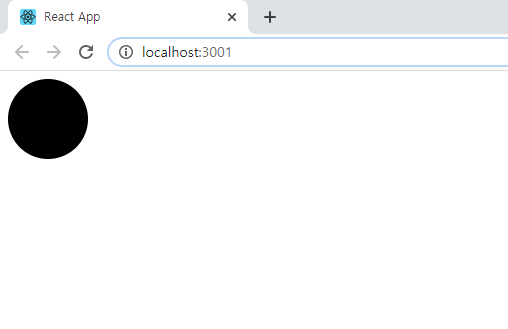
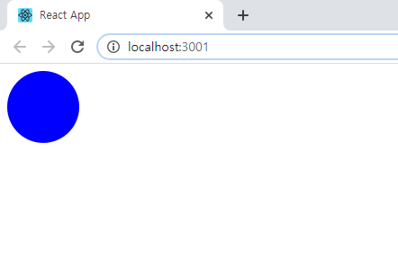
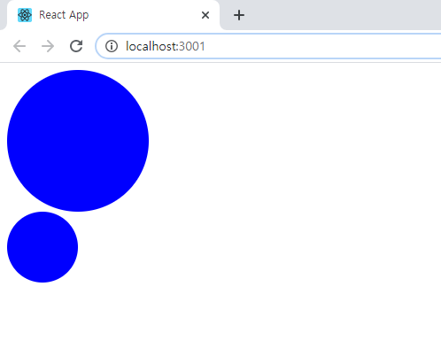
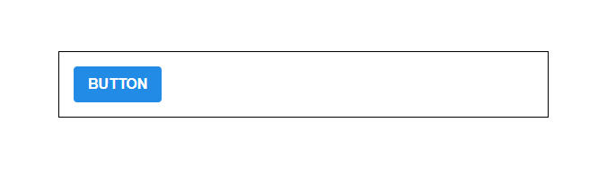

# styled-components

CSS in JS를 쉽게 할 수 있게 해주는 라이브러리이다.

## Tagged Template Literal

style-components는 Tagged Template Literal 이라는 문법을 활용하여 구현되어 있다.
그렇기 때문에 Tagged Template Literal을 이해하면 내부적으로 어떻게 작동하는 지 이해할 수 있다.
Template Literal은 문자열 조합을 쉽게 해주는 ES6 문법이다.

```javascript
const name = 'react';
const message = `hello ${name}`;

console.log(message);
// "hello react"
```

`${}`에 문자열이 들어가는 것을 확인할 수 있다. 

```javascript
const object = { a : 1};
const text = `${object}`
console.log(text);
// "[object Object]"

const fn = () => true
const msg = `${fn}`
console.log(msg);
// "() => true"
```

객체나 함수를 넣으면 그 자체가 문자화 되어 저장됨을 알 수 있다.

이런 Template Literal을 사용하면서 그 내부에 넣은 자바스크립트의 값을 조회하고 싶다면, 

Tagged Template Literal 문법을 사용해야 한다.

```javascript
const red = "빨간색"
const blue = "파란색"
function favoriteColors(texts, ...values) {
    console.log(texts);
    console.log(values);
}
favoriteColors`제가 좋아하는 색은 ${red}과 ${blue}입니다.`
// (3) ["제가 좋아하는  색은 ", "과 ", "입니다.", raw: Array(3)]
// (2) ["빨간색", "파란색"]
```

rest 문법을 사용하여 ${}로 넣어준 값과 텍스트를 따로 확인할 수 있다.

이러한 문법을 이용하여 props로 전달받아 조건에 맞는 style-components를 구현할 수 있다.

```javascript
const StyledDiv = styled`
  background: ${props => props.color};
`;
```

`${}`에 함수를 넣어줬다면, Tagged Template Literal을 사용하여 해당 함수를 활용할 수 있습니다.

```javascript
function sample(texts, ...fns) {
  const mockProps = {
    title: '안녕하세요',
    body: '내용은 내용내용 입니다.'
  };
  console.log("texts: ", texts)
  console.log("fns: ", fns)
  return texts.reduce((result, text, i) => `${result}${text}${fns[i] ? fns[i](mockProps) : ''}`, '');
}
sample`
  제목: ${props => props.title}
  내용: ${props => props.body}
`
/*
texts: [ '\n  제목: ', '\n  내용: ', '\n' ] 
fns: [ [Function], [Function] ]
"
  제목: 안녕하세요
  내용: 내용은 내용내용 입니다.
"
*/
```

sample 함수는 입력값을 texts와 fns으로 나누게 됩니다.  그다음 reduce 함수에 의해 결과 값을 나타내고 있습니다.


### styled-components 사용하기

개발환경 구성, styled-components 설치

```bash
$ create-react-app styling-with-styled-components
$ cd styling-with-styled-components
$ npm i styled-components
```


- App.js

  ```react
  import React from "react";
  import styled from "styled-components";
  
  const Circle = styled.div`
    width: 5rem;
    height: 5rem;
    background: black;
    border-radius: 50%;
  `;
  
  function App() {
    return <Circle />;
  }
  
  export default App;
  ```

  

  

  styled-components 를 통해 스타일을 입력하면서 해당 스타일을 가진 컴포넌트를 만들 수 있다.

  props에 color 조건을 넣어 색을 바꿀 수 있다.

  

- App.js

  ```javascript
  import React from "react";
  import styled from "styled-components";
  
  const Circle = styled.div`
    width: 5rem;
    height: 5rem;
    background: ${(props) => props.color || "black"};
    border-radius: 50%;
  `;
  
  function App() {
    return <Circle color="blue" />;
  }
  
  export default App;
  ```
  
  
  
  
  
  
  
  color에 blue 값을 주어 색을 바꿀 수 있게 되었다. 다음은 huge props를 설정하여 크기를 키우는 작업을 할 것이다.
  
- App.js
  
  ```javascript
  import React from "react";
  import styled, { css } from "styled-components";
  
  const Circle = styled.div`
    width: 5rem;
    height: 5rem;
    background: ${(props) => props.color || "black"};
    border-radius: 50%;
    ${(props) =>
      props.huge &&
      css`
        width: 10rem;
        height: 10rem;
      `}
  `;
  
  const App = () => (
    <>
      <Circle color="blue" huge />
      <Circle color="blue" />
    </>
  );
  
  export default App;
  ```
  
  

	
	
	props에 huge를 주고 huge가 있다면 css를 적용하도록 하였다.
	
	이런식으로 여러 줄의 CSS 코드를 조건부로 보여주고 싶다면 `css` 를 사용해야합니다., `css` 를 불러와서 사용을 해야 그 스타일 내부에서도 다른 `props` 를 조회 할 수 있습니다.


### Button 만들기


- components/Button.js

  ```react
  import React from "react";
  import styled from "styled-components";
  
  const StyledButton = styled.button`
    /* 공통 스타일 */
    display: inline-flex;
    outline: none;
    border: none;
    border-radius: 4px;
    color: white;
    font-weight: bold;
    cursor: pointer;
    align-items: center;
    padding-left: 1rem;
    padding-right: 1rem;
    /* 크기 */
    font-size: 1rem;
    height: 2.5rem;
    /* 색상 */
    background: #228be6;
    &:hover {
      background: #339af0;
    }
    &:active {
      background: #1c7ed6;
    }
  
    /* 기타 */
    & + & {
      margin-left: 1rem;
    }
  `;
  
  function Button({ children, ...rest }) {
    return <StyledButton {...rest}>{children}</StyledButton>;
  }
  
  export default Button;
  ```

  

  

  

  

  

  

  